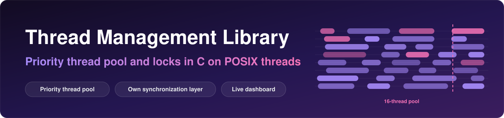
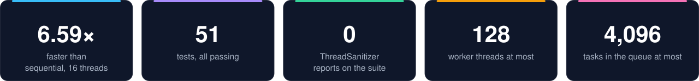
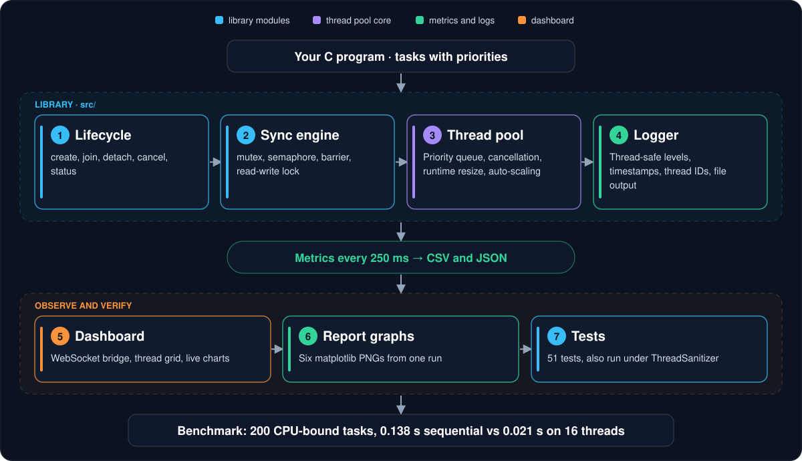

<p align="center">
  
</p>

<div align="center">


**A thread management library in C on POSIX threads: lifecycle control, mutex, semaphore, barrier and read-write lock, and a priority thread pool with task cancellation, runtime resizing and optional auto-scaling.**<br>
It also ships a thread-safe logger, time-series metrics and a live browser dashboard.

[📊 Benchmark](#-benchmark-results) · [🧩 How it works](#-how-it-works) · [🚀 Build and run](#-build-and-run) · [🧪 Testing](#-testing)

</div>

<p align="center">
  
</p>

<p align="center">
  <br>
  <sub>One benchmark run: 1,130 tasks through a 16-thread pool.</sub>
</p>

> [!NOTE]
> Hard limits: up to **128** worker threads and a **4,096**-task queue (`MAX_POOL_SIZE` and `MAX_QUEUE_SIZE` in `include/thread_pool.h`).

## ✨ What makes it different

<table>
  <tr>
    <td width="50%" valign="top">
      <h4>🧵 One small library</h4>
      Thread lifecycle, four synchronization primitives, a priority thread pool and a thread-safe logger, written in C on POSIX threads.
    </td>
    <td width="50%" valign="top">
      <h4>🎚 A pool you can steer</h4>
      Priority levels, cancellation of queued tasks, runtime resizing and an auto-scaling mode driven by a monitor thread.
    </td>
  </tr>
  <tr>
    <td valign="top">
      <h4>🔍 Checked for races</h4>
      51 tests, also run under ThreadSanitizer. The sanitizer found two real data races during review; both are fixed and the suite now runs without reports.
    </td>
    <td valign="top">
      <h4>📈 Observable</h4>
      Metrics every 250 ms to CSV and JSON, six report graphs, and a live browser dashboard over a WebSocket bridge.
    </td>
  </tr>
</table>

## 📊 Benchmark Results

One run on a local machine with a 16-thread pool. Exact numbers vary from run to run and with core count; the table matches the graphs below.

| Metric | Value |
| --- | --- |
| Tasks submitted | 1,130 |
| Tasks completed | 1,126 |
| Tasks cancelled | 4 |
| Tasks failed | 0 |
| Live threads | 16 |
| Throughput | ~189.9 tasks/sec |
| Avg wait time | 1,916.68 ms |
| Avg exec time | 65.17 ms |
| Elapsed | 5.93 s |
| Sequential vs pool (200 CPU-bound tasks) | 0.138 s vs 0.021 s — **6.59×** |
| Test suite | 51 / 51 passing |

The speedup depends on the number of cores: CPU-bound tasks on a single-core machine run at roughly 1× (measured 1.02× on one core).

<p align="center">
  
</p>

<table>
  <tr>
    <td></td>
    <td></td>
  </tr>
  <tr>
    <td></td>
    <td></td>
  </tr>
</table>

## 🧩 How it works

<p align="center">
  
</p>

## 🚀 Build and run

```
make          # compile
make run      # run the full demo
make test     # run the 51-test suite
make graphs   # generate report graphs (PNG, written to report/graphs/)
make server   # live dashboard on http://localhost:8080
make clean    # remove build artifacts
```

**Prerequisites:** GCC with pthread support (`build-essential`), Python 3, and `pip install websockets matplotlib` for the dashboard and graphs.

## 🧪 Testing

51 tests cover the lifecycle, synchronization, pool, priority, metrics, cancellation, resizing, logger, CSV export and a 500-task scalability run:

| Area | Tests |
| --- | --- |
| Thread lifecycle | 4 |
| Synchronization (mutex, semaphore, barrier, rwlock) | 13 |
| Thread pool | 7 |
| Priority scheduling | 4 |
| Pool metrics | 5 |
| Task cancellation | 5 |
| Dynamic resize | 4 |
| Logger | 5 |
| CSV export | 2 |
| Scalability (500 tasks) | 2 |

**🔍 Race checking.** The suite was also run under ThreadSanitizer. It found two data races, both now fixed: an unsynchronised shutdown flag for the monitor thread (now `atomic_int`), and the mutex wrapper clearing its `is_locked` flag after releasing the lock (now cleared before). To repeat the check:

```
mkdir -p build/metrics
gcc -pthread -Iinclude -O1 -g -fsanitize=thread src/*.c tests/test_all.c -o test_tsan -lm
./test_tsan
```

## 📚 Reference

<details>
<summary><b>✨ Full feature list</b></summary>

### Core modules

- ✅ **Thread lifecycle manager** — create, join, detach, cancel, status tracking
- ✅ **Synchronization engine** — mutex, semaphore, barrier, read-write lock
- ✅ **Thread pool** — fixed-size or auto-scaling, with a priority queue
- ✅ **Priority scheduling** — NORMAL / HIGH / CRITICAL task levels

### Pool extras

- 🚀 **Task cancellation** — cancel queued tasks by ID before they run
- 🚀 **Dynamic resizing** — grow or shrink the pool at runtime
- 🚀 **Auto-scaling** — a monitor thread adjusts the pool based on load
- 🚀 **Thread-safe logger** — levels, timestamps, thread IDs, file output
- 🚀 **Live metrics** — snapshots every 250 ms, exported as CSV and JSON
- 🚀 **Benchmark** — sequential vs pool execution of CPU-bound tasks

### Observability

- 📊 **Live browser dashboard** — thread grid, terminal output and Chart.js charts
- 📈 **Report graphs** — six matplotlib PNGs in `graphs/`

</details>

<details>
<summary><b>📂 Project structure</b></summary>

```
thread-management-library/
├── include/                       # headers
│   ├── thread_lifecycle.h
│   ├── sync_engine.h
│   ├── thread_pool.h
│   └── logger.h
├── src/                           # implementations
│   ├── thread_lifecycle.c
│   ├── sync_engine.c
│   ├── thread_pool.c
│   └── logger.c
├── tests/test_all.c               # 51 tests
├── gui/dashboard_connected.html   # dashboard served by server.py
├── scripts/generate_report_graphs.py
├── graphs/                        # sample report graphs (PNG)
├── main.c                         # demo and benchmark
├── server.py                      # WebSocket bridge for the dashboard
└── Makefile
```

</details>

<details>
<summary><b>📘 API reference</b></summary>

### Thread lifecycle

```c
ThreadHandle* thread_create(void* (*func)(void*), void* arg, int id);
int           thread_join(ThreadHandle* handle);
int           thread_detach(ThreadHandle* handle);
int           thread_cancel(ThreadHandle* handle);
ThreadState   thread_status(ThreadHandle* handle);
```

### Synchronization

```c
MutexHandle*   mutex_init();          int mutex_lock(MutexHandle* m);
SemHandle*     sem_create(int n);     int sem_wait_custom(SemHandle* s);
BarrierHandle* barrier_init(int n);   int barrier_wait_custom(BarrierHandle* b);
RWLockHandle*  rwlock_init();         int rwlock_rdlock(RWLockHandle* rw);
```

### Thread pool

```c
ThreadPool* pool_init(int size);
ThreadPool* pool_init_ex(int size, int min_t, int max_t, int auto_scale);
int         task_submit(ThreadPool* p, void (*f)(void*), void* arg, int id);
int         task_submit_priority(ThreadPool* p, ..., TaskPriority pri, const char* name);
int         task_cancel(ThreadPool* p, int task_id);
int         pool_resize(ThreadPool* p, int new_size);
int         pool_export_csv(ThreadPool* p, const char* path);
int         pool_export_history_json(ThreadPool* p, const char* path);
```

### Logger

```c
logger_init(LOG_INFO, "runtime.log");
LOG_I("module", "formatted %d message", value);
LOG_W("module", "warning");
LOG_E("module", "error");
```

</details>

<details>
<summary><b>🎨 Dashboard</b></summary>

`make server` starts a WebSocket bridge that runs the C binary and streams its output to the browser at `http://localhost:8080`:

- **Metric strip** — six stats parsed live from the program output
- **Thread visualizer** — animated grid of thread states
- **Live terminal** — colour-coded output from the C binary
- **Four live charts** — throughput, completed tasks, queue depth, live threads

</details>

<details>
<summary><b>📚 References</b></summary>

1. David R. Butenhof, *Programming with POSIX Threads*
2. Michael Kerrisk, *The Linux Programming Interface*
3. Chart.js documentation — <https://www.chartjs.org/>
4. Matplotlib documentation — <https://matplotlib.org/>
5. `pthread(7)` and `pthread_*(3)` man pages

</details>
